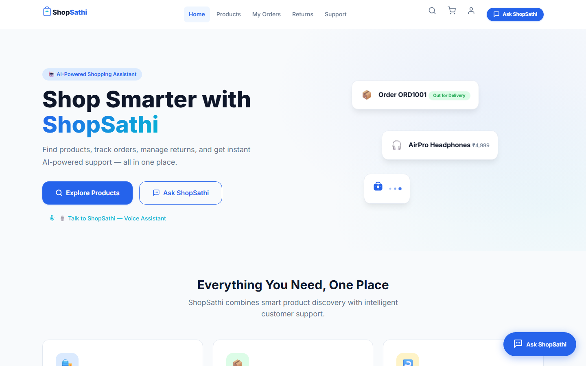
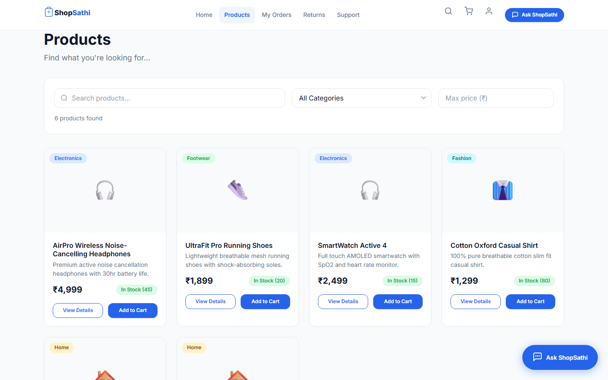
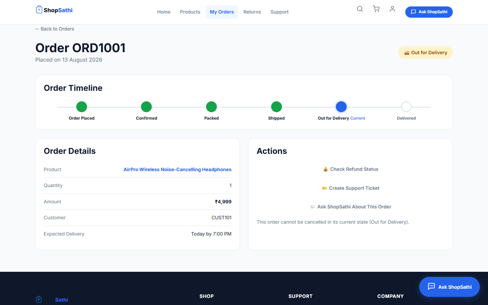
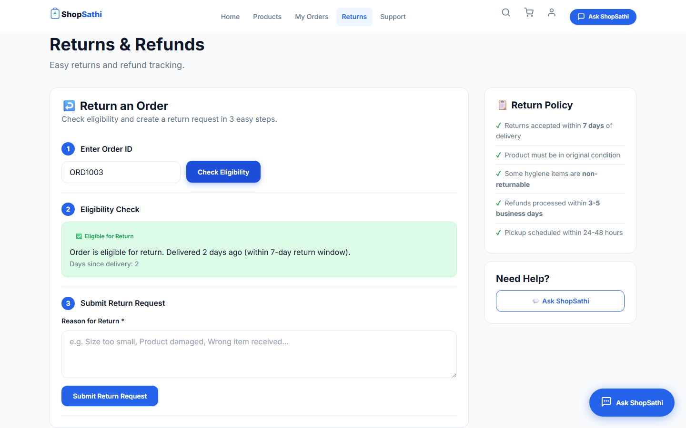
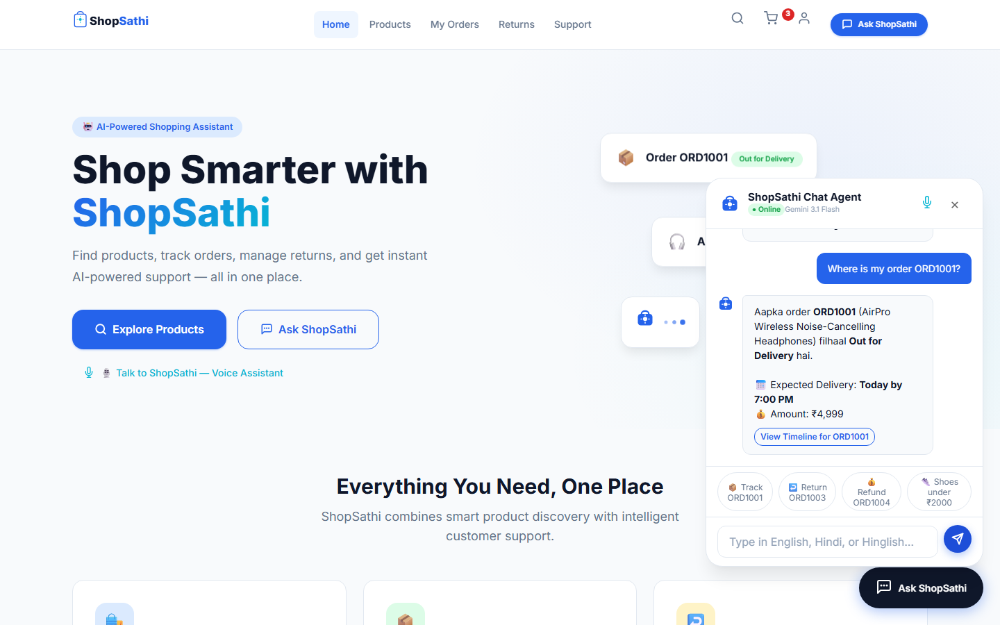
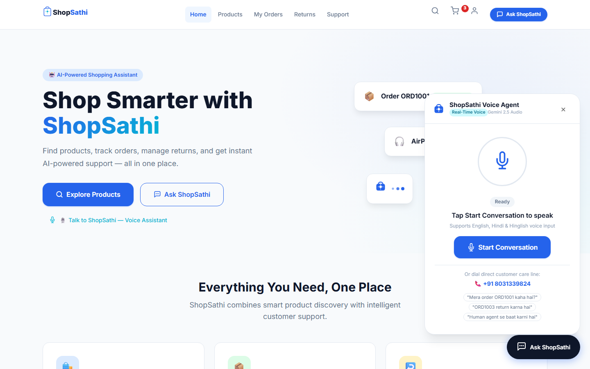
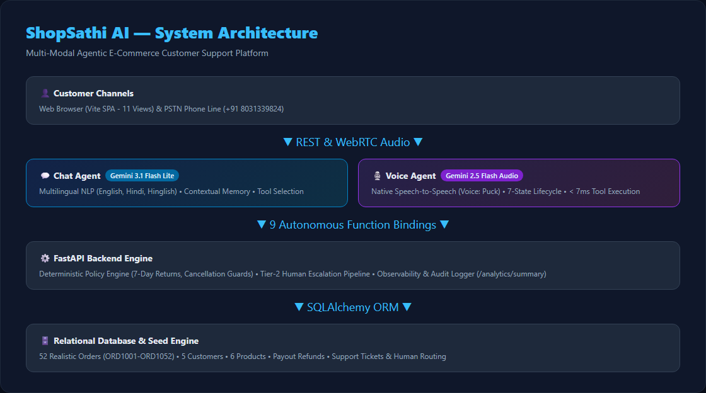

# ShopSathi AI

> **"Smart Shopping. Smarter Support."**  
> *AI-powered e-commerce customer support that speaks, acts, and seamlessly escalates to human agents.*  
> **Kipps.AI Developer Hackathon 2026**

[](https://github.com/Mahendra7073/shopsathi-ai)
[](https://github.com/Mahendra7073/shopsathi-ai)
[](https://shopsathi-ai.onrender.com/app/)
[](https://python.org)
[](https://fastapi.tiangolo.com)
[](https://ai.google.dev)

---

## 🌐 Live Production Links

* 🛍️ **Production Web Application**: [https://shopsathi-ai.onrender.com/app/](https://shopsathi-ai.onrender.com/app/)
* 📊 **Admin Monitoring Dashboard**: [https://shopsathi-ai.onrender.com/static/index.html](https://shopsathi-ai.onrender.com/static/index.html)
* 📖 **Interactive Swagger API Docs**: [https://shopsathi-ai.onrender.com/docs](https://shopsathi-ai.onrender.com/docs)
* 🩺 **Health Check API**: [https://shopsathi-ai.onrender.com/health](https://shopsathi-ai.onrender.com/health)
* 🐙 **GitHub Repository**: [https://github.com/Mahendra7073/shopsathi-ai](https://github.com/Mahendra7073/shopsathi-ai)
* 📞 **Direct Real-Time Voice Support**: `+91 8031339824`

---

## 🚀 Overview & Problem Statement

### 💡 The Problem
In modern e-commerce, customers are forced to navigate fragmented interfaces—jumping between product catalogs, parcel tracking portals, return wizards, and generic support forms. Traditional customer support chatbots suffer from severe limitations:
1. **Static & Scripted**: They only regurgitate static FAQ articles without taking action.
2. **Disconnected from Business Data**: They cannot look up live order statuses, calculate 7-day return policy windows, or track bank refund payouts.
3. **Hallucinations**: Without strict tool calling, generic LLMs invent fake tracking numbers, incorrect refund dates, or hallucinated order statuses.
4. **Dead-End Escalations**: When an unresolvable issue occurs (such as an unconfirmed UPI payment deduction), bots leave customers stranded without structured human handoff.

### 💡 The Solution
**ShopSathi AI** redefines e-commerce customer support through an **action-oriented, multi-modal Agentic AI workflow**. Rather than guessing or inventing transactional data, ShopSathi connects conversational AI agents directly to live backend REST APIs as their single source of truth.

```
Customer Input (Text / Speech)
               │
               ▼
┌───────────────────────────────────────────┐
│     Agentic Intent & Tool Selection       │
│   (Gemini 3.1 Flash Lite / 2.5 Audio)    │
└──────────────────────┬────────────────────┘
                       │
                       ▼
┌───────────────────────────────────────────┐
│     Deterministic Backend Tool Layer      │
│   (FastAPI REST APIs & Business Rules)   │
└──────────────────────┬────────────────────┘
                       │
                       ▼
┌───────────────────────────────────────────┐
│     Ground-Truth Database Response        │
│ (Orders, Returns, Refunds, Support Tkts) │
└──────────────────────┬────────────────────┘
                       │
                       ▼
┌───────────────────────────────────────────┐
│     Natural Multi-Modal Response /        │
│       Tier-2 Human Escalation             │
└───────────────────────────────────────────┘
```

---

## 🤖 9 Core Autonomous AI Tools

Every AI interaction in ShopSathi executes against real backend endpoints:

| # | Tool Name | API Endpoint | Purpose | Natural Language User Example |
|---|---|---|---|---|
| 1 | `search_products` | `GET /products/search` | Filters catalog by query, category, and budget. | *"Show running shoes under ₹2000"* |
| 2 | `check_order_status` | `POST /orders/lookup` | Fetches live tracking status and delivery timeline. | *"Where is my order ORD1001?"* |
| 3 | `cancel_order` | `POST /orders/cancel` | Cancels eligible processing orders with state guards. | *"Please cancel my order ORD1005"* |
| 4 | `check_return_eligibility` | `POST /orders/return-eligibility` | Evaluates 7-day window and hygiene rules. | *"Can I return my order ORD1003?"* |
| 5 | `create_return_request` | `POST /returns` | Creates a return request record and assigns pickup. | *"Initiate return for ORD1003: wrong size"* |
| 6 | `check_refund_status` | `POST /orders/refund-status` | Tracks bank refund payout ID and expected date. | *"What is the refund status for ORD1004?"* |
| 7 | `create_support_ticket` | `POST /support/tickets` | Generates a categorized support ticket. | *"My payment was deducted for ORD1005"* |
| 8 | `check_support_ticket` | `POST /support/tickets/status` | Retrieves real-time ticket resolution progress. | *"Check status of support ticket TKT9001"* |
| 9 | `escalate_support_ticket`| `POST /support/tickets/escalate`| Immediately routes complex dispute to Tier 2 human. | *"I need to speak with a human supervisor"* |

---

## 💬 Multi-Modal AI Agents

### 1. Chat Agent
* **Model**: **Gemini 3.1 Flash Lite**
* **Languages**: **English, Hindi, and Hinglish** (e.g., *"Mera order ORD1001 kahan hai?"*)
* **Architecture**: Direct function-calling integration with all 9 core backend tools.
* **Deterministic Guardrails**: The agent never invents tracking IDs or order states. If backend data is unavailable, it gracefully prompts the customer or offers human escalation.

### 2. Real-Time Voice Agent
* **Model**: **Gemini 2.5 Flash Native Audio Preview**
* **Voice**: **Puck** (`en-US`)
* **Direct Outbound Phone Support**: `+91 8031339824`
* **7-State Audio Lifecycle**: `Connecting` ➔ `Connected` ➔ `Listening` ➔ `Processing` ➔ `Speaking` ➔ `Ended`
* **Performance**: Sub-second speech-to-speech responsiveness with average backend tool execution latency `< 7ms`.
* **Controls**: Live audio waveform visualizer, speech-to-text live transcript box, microphone toggle, speaker mute, and end call.

---

## 🛒 Full-Featured E-Commerce Experience

ShopSathi includes a complete, responsive 11-page Single Page Application:

* 🏠 **Home (`#/`)**: Dynamic hero banner, quick category navigation, system metrics, and dual AI launcher.
* 👟 **Products (`#/products`)**: Real-time debounced search, category filter, budget slider, and stock badges.
* 🔍 **Product Detail (`#/products/:id`)**: High-res product imagery, specifications, 7-day return policy tags, and quantity controls.
* 🛍️ **Cart (`#/cart`)**: Persistent `localStorage` cart, live subtotal & tax calculations, and clear-cart modal.
* 💳 **Checkout (`#/checkout`)**: Customer delivery address form, order summary, and payment selector (COD, UPI, Card).
* 📦 **My Orders (`#/orders`)**: Real-time order lookup, responsive pagination (10 orders per page), and status filter dropdown across 52 orders.
* 🚚 **Order Detail (`#/orders/:id`)**: 6-step visual delivery timeline (`Placed` ➔ `Confirmed` ➔ `Packed` ➔ `Shipped` ➔ `Out for Delivery` ➔ `Delivered`) and cancellation guards.
* 🔄 **Returns & Refunds (`#/returns`)**: 4-step interactive return wizard with 7-day policy validation and refund status lookup.
* 🎫 **Support Center (`#/support`)**: 8 quick-action cards, support ticket generator, ticket tracker, and Tier 2 human escalation.
* 👤 **Customer Profile (`#/profile`)**: Dynamic customer info, order count, and quick navigation links.
* 🔑 **Login Switcher (`#/login`)**: Fast demo customer switcher (`CUST101` – `CUST105`) and manual login.

---

## 📸 Screenshots & Interactive Application Previews

| 🏠 Modern E-Commerce Home | 👟 Real-Time Product Catalog & Filter |
|:---:|:---:|
|  |  |

| 📦 52-Order Tracking & 6-Step Timeline | 🔄 7-Day Return Wizard & Refund Tracker |
|:---:|:---:|
|  |  |

| 💬 Gemini 3.1 Flash Lite Chat Agent | 🎙️ Gemini 2.5 Flash Native Voice Agent |
|:---:|:---:|
|  |  |

---

## 🏗️ System Architecture



```
                                  CUSTOMER
                                     │
           ┌─────────────────────────┴─────────────────────────┐
           ▼                                                   ▼
┌───────────────────────────┐                       ┌───────────────────────────┐
│     ShopSathi Frontend    │                       │  PSTN Voice Call (+91...) │
│   (Vite SPA / Vanilla JS) │                       └─────────────┬─────────────┘
└─────────────┬─────────────┘                                     │
              │                                                   │
              ▼                                                   ▼
┌───────────────────────────────────────────────────────────────────────────────┐
│                          KIPPS.AI AGENTIC LAYER                               │
│  ├── Chat Agent (Gemini 3.1 Flash Lite)                                       │
│  ├── Voice Agent (Gemini 2.5 Flash Native Audio Preview - Voice: Puck)        │
│  └── 9 Autonomous Tool Function Definitions                                   │
└──────────────────────────────────────┬────────────────────────────────────────┘
                                       │ REST / JSON (Tool Calls)
                                       ▼
┌───────────────────────────────────────────────────────────────────────────────┐
│                          FASTAPI BACKEND ENGINE                               │
│  ├── Routers: /products, /orders, /returns, /refunds, /support, /customers   │
│  ├── Deterministic Policy Engine (7-Day Return Policy, Cancellation Guards)   │
│  ├── Tier-2 Human Escalation & Support Ticket Lifecycle Manager               │
│  └── Observability & Audit Logger (/analytics/summary)                        │
└──────────────────────────────────────┬────────────────────────────────────────┘
                                       │ SQLAlchemy ORM
                                       ▼
┌───────────────────────────────────────────────────────────────────────────────┐
│                      SQLITE / POSTGRESQL DATABASE                             │
│  ├── Products (6 catalog items with returnable flags)                         │
│  ├── Customers (5 seeded demo profiles: CUST101–CUST105)                      │
│  ├── Orders (52 realistic orders: ORD1001–ORD1052 across 8 distinct states)   │
│  ├── Returns & Refunds (Linked payout records: REF7001–REF7003)               │
│  └── Support Tickets & Audit Logs (TKT9001–TKT9003)                           │
└───────────────────────────────────────────────────────────────────────────────┘
```

---

## 🧰 Tech Stack

| Layer | Technology / Framework | Details |
|---|---|---|
| **Frontend** | HTML5, Modern CSS3 Tokens, Vanilla JavaScript ES6 | Custom responsive design system, zero external UI bloat |
| **Build & Bundler**| Vite v6.4 | Sub-second builds (400–600ms), asset hashing, relative base |
| **Backend** | Python 3.12, FastAPI, Uvicorn (ASGI) | Async REST API, Pydantic v2 schemas, CORS middleware |
| **Database & ORM**| SQLAlchemy ORM, SQLite / PostgreSQL | Relational schema, automated seed migrations |
| **Chat AI** | Google Gemini 3.1 Flash Lite | High-speed, multilingual multi-turn function calling |
| **Voice AI** | Google Gemini 2.5 Flash Native Audio Preview | Sub-second speech-to-speech audio, voice Puck |
| **Phone Gateway** | Kipps.AI Inbound/Outbound PSTN | Dedicated phone line: `+91 8031339824` |
| **Testing** | Pytest 9.1, TestClient, AnyIO | 63 automated unit & integration test suites (100% pass) |
| **Deployment** | Render Web Services (Docker / Python) | Continuous deployment from GitHub `main` |

---

## 📊 Pre-Seeded Demo Dataset (52 Orders)

The database is pre-seeded with **52 realistic orders** (`ORD1001` through `ORD1052`) distributed across 5 demo customers and 8 lifecycle states:

* **Processing (8 orders)**: e.g., `ORD1005`, `ORD1006`, `ORD1010` (Cancellable)
* **Confirmed (5 orders)**: e.g., `ORD1013`, `ORD1015`
* **Packed (5 orders)**: e.g., `ORD1018`, `ORD1020`
* **Shipped (7 orders)**: e.g., `ORD1023`, `ORD1024` (BlueDart tracking)
* **Out for Delivery (7 orders)**: e.g., `ORD1001`, `ORD1030`, `ORD1034`
* **Delivered (14 orders)**: e.g., `ORD1002` (Expired window), `ORD1003` (Return eligible)
* **Cancelled (4 orders)**: e.g., `ORD1048`, `ORD1049` (Linked to `REF7002`)
* **Returned / Requested (4 orders)**: e.g., `ORD1004` (Linked to `REF7001`), `ORD1051`

---

## 🧪 Testing & Quality Assurance

### 1. Automated Backend Test Suite (63 Tests)
```bash
.\venv\Scripts\python -m pytest -v
```
**Output**: `63 passed, 0 failed in 2.68s (100% pass rate)`
* `tests/test_analytics.py`: Observability and metrics
* `tests/test_customers.py`: Customer profiles and customer orders
* `tests/test_health.py`: Uptime verification
* `tests/test_orders.py`: Lookups, cancellations, 52-order count, uniqueness
* `tests/test_products.py`: Search, budget filtering, catalog
* `tests/test_refunds.py`: Payout tracking and validation
* `tests/test_returns.py`: 7-day policy engine and return creation
* `tests/test_security.py`: API authentication and key isolation
* `tests/test_support.py`: Ticket creation, status check, and Tier 2 escalation

### 2. Frontend Production Build
```bash
cd frontend && npm run build
```
**Output**: `✓ built in 514ms` (Clean minified bundle in `frontend/dist/`)

### 3. Responsive Verification
Audited across:
* **Desktop** (`1920×1080`)
* **Laptop** (`1366×768`)
* **Tablet** (`768×1024`)
* **Mobile** (`390×844`) — Zero horizontal overflow, collapsible drawer, full-width touch-friendly chat and voice visualizers.

---

## ▶️ Local Quickstart Guide

### Prerequisites
* Python 3.11+
* Node.js v18+ (for frontend development)

### 1. Clone & Set Up Backend
```bash
# Clone the repository
git clone https://github.com/Mahendra7073/shopsathi-ai.git
cd shopsathi-ai

# Create virtual environment
python -m venv venv
# On Windows:
.\venv\Scripts\activate
# On Linux/macOS:
source venv/bin/activate

# Install dependencies
pip install -r requirements.txt

# Run backend server
python -m uvicorn app.main:app --reload --port 8000
```

### 2. Run Frontend Development Server
```bash
cd frontend
npm install
npm run dev
```

* **Frontend SPA**: [http://localhost:5173](http://localhost:5173) (or [http://localhost:8000/app/](http://localhost:8000/app/))
* **Admin Dashboard**: [http://localhost:8000/static/index.html](http://localhost:8000/static/index.html)
* **Swagger API Docs**: [http://localhost:8000/docs](http://localhost:8000/docs)

---

## 🔐 Security & Data Privacy

* **Zero Client-Side Secrets**: No API keys, Gemini keys, or database credentials are exposed in client-side code or git commits.
* **Server-Side Key Isolation**: All LLM and function-calling authentication is managed securely server-side.
* **Input Sanitization**: Pydantic v2 validates all incoming payloads against strict schemas.
* **CORS & Environment Protections**: Fully configurable via environment variables (`ALLOWED_ORIGINS`, `DATABASE_URL`).

---

## 🏆 Hackathon Highlights & Judge Quick Links

1. 📄 **[DEMO_SCRIPT.md](file:///c:/Users/ASUS/kipps%20ai%20hackathon/docs/DEMO_SCRIPT.md)** — Step-by-step 3–5 minute live presentation script.
2. 📄 **[JUDGE_TALKING_POINTS.md](file:///c:/Users/ASUS/kipps%20ai%20hackathon/docs/JUDGE_TALKING_POINTS.md)** — Architectural & technical judge Q&A.
3. 📄 **[DEMO_DATA.md](file:///c:/Users/ASUS/kipps%20ai%20hackathon/docs/DEMO_DATA.md)** — Cheat sheet of 52 orders and test scenarios.
4. 📄 **[FEATURE_MATRIX.md](file:///c:/Users/ASUS/kipps%20ai%20hackathon/docs/FEATURE_MATRIX.md)** — Complete feature-to-code mapping matrix.
5. 📄 **[PROJECT_DESCRIPTIONS.md](file:///c:/Users/ASUS/kipps%20ai%20hackathon/docs/PROJECT_DESCRIPTIONS.md)** — Submission elevator pitches and descriptions.
6. 📄 **[KIPPS_SETUP.md](file:///c:/Users/ASUS/kipps%20ai%20hackathon/docs/KIPPS_SETUP.md)** — Agent prompt and function configuration guide.

---

**Built with ❤️ for the Kipps.AI Developer Hackathon 2026**
