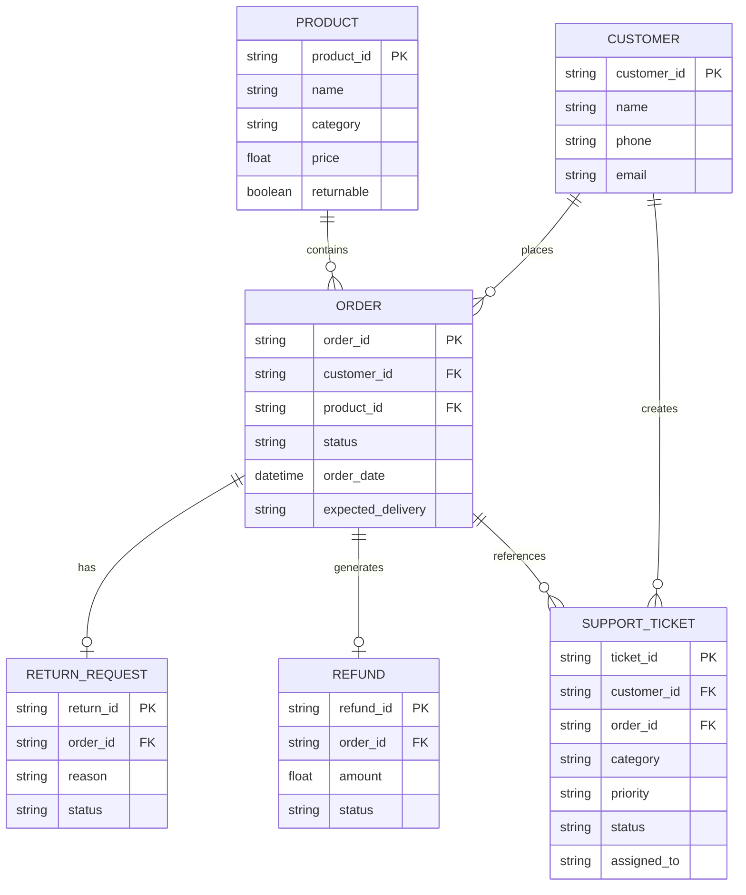

# ShopSathi AI — System Architecture & Design Document

## 1. System Overview

ShopSathi AI is an agentic customer support platform built for e-commerce. It uses Kipps.AI as the multi-agent reasoning and orchestration layer while serving business data, order actions, policies, and ticketing via a clean, high-performance FastAPI backend.

```
                  +-----------------------------------+
                  |        Customer Interface         |
                  |     (Web Chat & Voice Phone)      |
                  +-----------------+-----------------+
                                    |
            +-----------------------+-----------------------+
            |                                               |
  +---------v----------+                         +----------v---------+
  |  Kipps Chat Agent  |                         |  Kipps Voice Agent |
  | (Text Prompt/LLM)  |                         | (Conversational)   |
  +---------+----------+                         +----------+---------+
            |                                               |
            +-----------------------+-----------------------+
                                    |
                     +--------------v--------------+
                     |    Kipps Knowledge Base     |
                     | (Static Policies & FAQs)    |
                     +--------------+--------------+
                                    |
                     +--------------v--------------+
                     |    Kipps.AI API Functions   |
                     |  (Tool Calls / JSON Specs)  |
                     +--------------+--------------+
                                    | REST (HTTP)
                     +--------------v--------------+
                     |     ShopSathi REST API      |
                     |    (FastAPI / Python)       |
                     +--------------+--------------+
                                    |
        +---------------------------+---------------------------+
        |                           |                           |
+-------v-------+           +-------v-------+           +-------v-------+
| Orders &      |           | Products &    |           | Support &     |
| Returns API   |           | Search API    |           | Escalation    |
+-------+-------+           +-------+-------+           +-------+-------+
        |                           |                           |
        +---------------------------+---------------------------+
                                    |
                     +--------------v--------------+
                     |     SQLite / PostgreSQL     |
                     |    (Database Layer)         |
                     +-----------------------------+
```

---

## 2. Intent-to-Function Mapping Matrix

| User Intent | Kipps Function Called | REST Endpoint | HTTP Method | Expected Output |
| :--- | :--- | :--- | :--- | :--- |
| Order Tracking | `check_order_status` | `/orders/{order_id}` | `GET` | Real-time status, expected delivery date |
| Return Eligibility | `check_return_eligibility` | `/orders/{order_id}/return-eligibility` | `GET` | Eligibility boolean, window calculation |
| Request Return | `create_return_request` | `/returns` | `POST` | Return ID (`RETxxxx`), confirmation message |
| Refund Inquiry | `check_refund_status` | `/orders/{order_id}/refund` | `GET` | Refund ID (`REFxxxx`), status, payout date |
| Product Recommendation | `search_products` | `/products/search` | `GET` | Product catalog array matching budget & query |
| Cancel Order | `cancel_order` | `/orders/{order_id}/cancel` | `POST` | Status `Cancelled`, refund notification |
| Create Ticket | `create_support_ticket` | `/support/tickets` | `POST` | Ticket ID (`TKTxxxx`), category, priority |
| Human Escalation | `escalate_support_ticket` | `/support/tickets/{ticket_id}/escalate` | `POST` | Status `Escalated`, assigned agent tier |

---

## 3. Data Schema & Relationships


